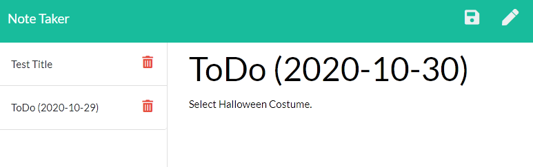

# Note_Taker
This app is a note taker application that allows users to create, retrieve, and delete notes.
The browser/front-end code was provided. My task was to implement the Express server backend. Specifically, GET, POST, and DELETE endpoints were implemented in Express to allow for the retrieval, addition, and deletion of notes from a json file stored on the server.

The app was then deployed to heroku. You can view it [here](https://obscure-spire-90740.herokuapp.com/).
